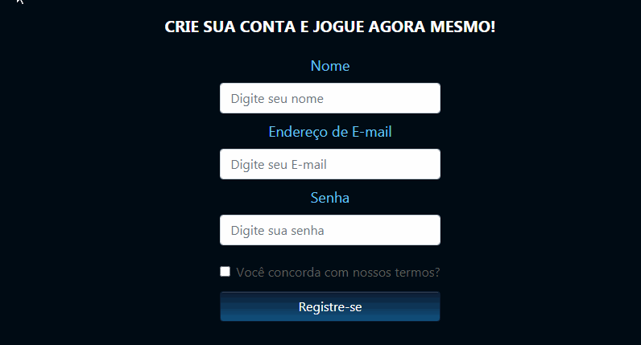
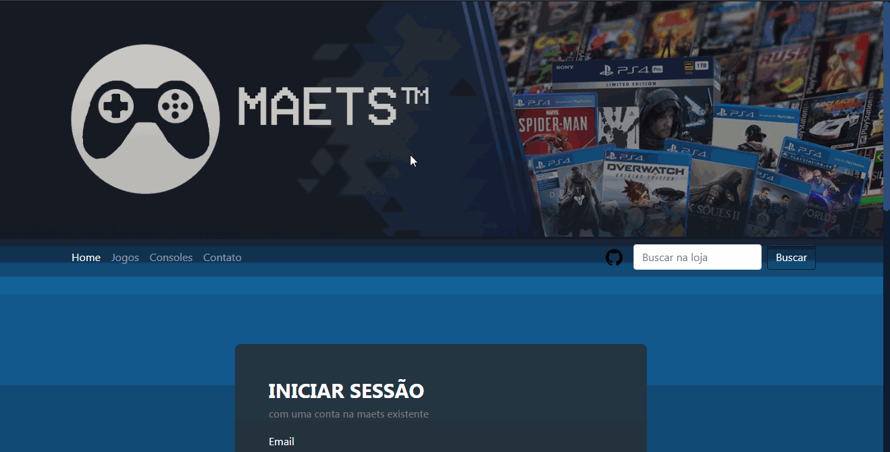
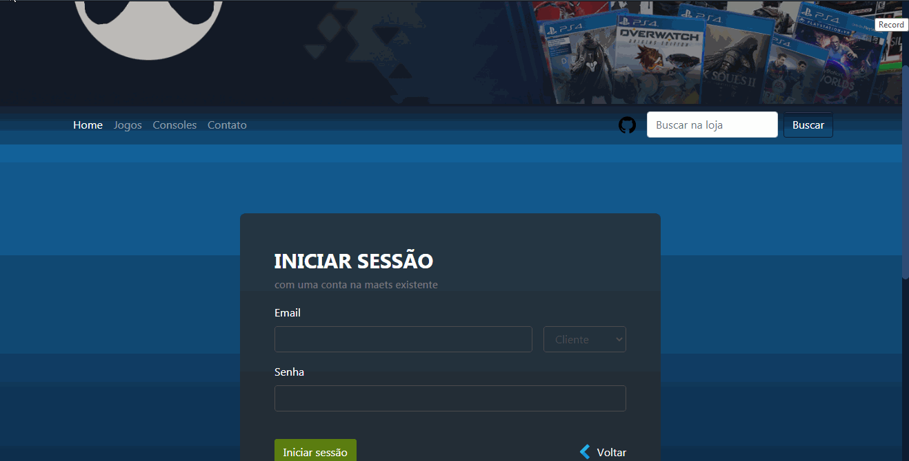
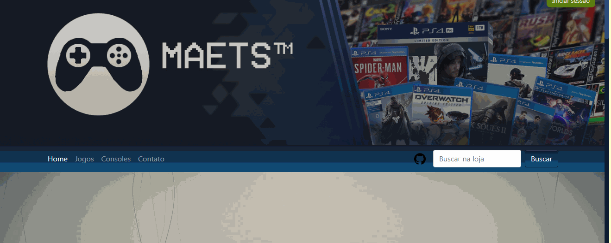
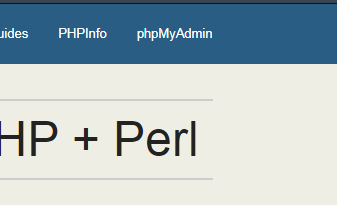
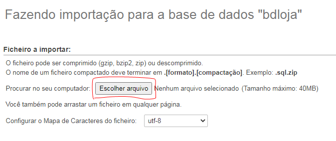
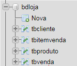

# Game Store


# Sobre
Esse é um projeto feito para aula de **Programação Web II**. Veja a seguir como o projeto foi proposto pela professora **Vanessa Ferraz**:


## Projeto: Site de uma loja virtual
### Orientações Gerais
O projeto será desenvolvido em etapas, em grupos com 4 integrantes. Orientamos que os colegas da turma que não possuem computador, sejam incluídos nas equipes, pois podem colaborar com outras atividades além da programação. Cada etapa, será orientado o desenvolvimento, os elementos e conteúdo que farão parte da entrega da etapa.

### Escopo
Site de uma loja virtual de ..... (Fica a escolha do grupo o tema da loja).

* **O site terá o seguinte menu**:
    * **home**: com banner das promoções da loja
    * **produtos**: apresentando os produtos da loja com foto, nome, valor
    * **cadastre-se**: uma área de cadastro para se tornar um cliente e realizar compras
    * **contato**: formulário para enviar uma mensagem


* **Deverá ter uma área no menu do site para realizar o login**.

* **O login poderá ser feito pelo:**
    * administrador da loja: o menu da loja será
        * **clientes**: onde será apresentada uma lista dos clientes cadastrados
        * **produtos**: onde aparecerá um formulário para cadastrar produtos novos e uma lista
        * _**vendas**: uma lista das vendas realizadas (esse não deu tempo para terminar nesse semestre)_ 

    * cliente: o menu será o mesmo da área externa, porém deverá trocar o menu cadastre-se pelo carrinho e em cada produto deverá aparecer um link para adicionar o produto no carrinho. O menu carrinho deverá aparecer os produtos que foram adicionados e um botão para finalizar a compra. Também deverá ter um novo item no menu para Pedidos, onde listará os pedidos que foram feitos pelo cliente.

### Fases do projeto
| Fase  | Descrição | Prazo de entrega|
| ---   | ----      | ----            |
|1      |Layout das páginas da área externa (home, produtos, cadastre-se, contato)|25/06/2020
|2      | - Rotina de login para o administrador<br> - Layout das páginas da área interna do administrador (home, clientes, produtos, vendas) <br> - Cadastro e consulta de produtos no perfil |15/07/2020|
|3      |- Cadastro de clientes na área externa<br> - Rotina de login para os clientes<br> - Consulta de clientes (lista) no perfil do administrador|24/07/2020|


_a parte da venda não deu tempo para ser feita nesse semestre, talvez no futuro._

# Projeto 
Eu utilizei o mesmo projeto de **Programação Web I** ( Esse projeto se encontra [nesse repósitório](https://github.com/Vitor-Carmo/Projeto-Final-PWI) ).

Esse projeto de Programação Web I, estava estático, ou seja,  sem banco de dados e não era dinâmico. Então, nessse repositório tem o mesmo frontend do projeto de **PWI**, e junto com ele o backend que eu desenvolvi nesse projeto final.


## Cadastro


### Registrar Cliente 
[register-client.php](src\controller\register-client.php)
```php
 header("Location: ../../index.php?sucess=true");

    $client = new Client();
    
    //pegando os valores dos forms via post
    $client->setSenhaClient($_POST['senha']);
    $client->setNameClient($_POST['nome']);
    $client->setEmailClient($_POST['email']);
    
    // registrar cliente
    $client->register($client);
```


## Login


### Válidar login
[login_validation.php](src\login_validation.php)

```php
    
    require_once 'global.php';

        $client = new Client();

        // lista todos os emails e senhas dos usuarios
        $list = $client->list();
        $find = false; // não encontrou nada

        
        foreach ($list as $row){ 
            // se o email e a senha é igual a algum email e a senha
            // da nossa base de dados
            if (($login == $row['emailcliente']) && ($senha == $row['senhacliente'])){
                $find = true; // foi encontrado

                $id = $row['idcliente']; //pega o id desse cara que foi encontrado 
                break; // quebra o loop
            }
        }

        // se for encontrado
        if($find){
            // inicia uma sessão
            session_start();

            $_SESSION['login-session'] = $login;
            $_SESSION['senha-session'] = $senha;
            $_SESSION['id'] = $id;

            //Vai para pasta reservada do cliente
            header("Location: ../private/client");
        }
        else{
            // voltar  para parte de login 
            header("Location: ../register.php?sucess=false");
        }

```


## Rota do Administrador

### Válidar login
[login_validation.php](src\login_validation.php)

```php
// se o email for igual adm@adm.com
// e senha igual 123
if (($login == 'adm@adm.com') && ($senha == '123')){
        // começar sessão
        session_start();
        $_SESSION['login-session'] = $login;
        $_SESSION['senha-session'] = $senha;
        
        // entrar na pasta reservada do adm
        header("Location: ../private/adm");
}else{
        // voltar para a parte do login
        header("Location: ../register.php?sucess=false");
}

```
## Administrador cadastrar um produto


### Produto registrado
Produto do homem aranha que foi registrado no exemplo:


### Registrar jogo
[register_product.php](src\controller\register-product.php)

```php
header("Location: ../../private/adm/register_product.php?sucess=true");

    $product = new Product();
    // setando os valores 
    $product->setDescProduct($_POST['txtdesc']);
    $product->setValueProduct($_POST['txtvalor']);
    $product->setQtdeProduct($_POST['txtqtde']);
    $product->setGenreProduct($_POST['slgenero']);
    $product->setConsoleProduct($_POST['slconsole']);
    
    // setando a foto
    $product->setPhotoProduct($_FILES['foto']['tmp_name']);

    //setando o nome da foto
    $product->setNamePhotoProduct($_FILES['foto']['name']);
    
    // registrar o produto
    $product->register($product);

    // pegar o id do produto
    $product = $product->consultId($product);

    // pegando a extensão do arquivo (ex: jpg, png ...)
    $extension = substr(strstr($product->getNamePhotoProduct(), "."),1);
    
    //setando o nome da photo como a pasta que a imagem está e com o id da imagem daquele produto
    $product->setNamePhotoProduct("img/product/" . $product->getIdProduct() .".".$extension);

    // registrando foto
    $product->registerPhoto($product);

    // movendo imagem para "public/img/product/" com o nome do id do produto dela
    move_uploaded_file($product->getPhotoProduct(), "../../public/".$product->getNamePhotoProduct());
```
As imagens cadastradas no banco vão estar em [public/img/product](public/img/product)
 
## Procurar Produto


### Código para procurar produto
[search.php](src\search.php)
```php

// verificar se realmente está setado o searchgame 
// ( searchgame é o nome da pesquisa do usuário ) 
if(isset($_GET['searchgame']))
{
    // tirar o excesso de espaço
    $searchgame = trim($_GET['searchgame']);

    // se for diferente de vazio
    if($searchgame != ''){
        // procura o game no banco e joga na variável game
        $game = $products->searchGame($searchgame);    

        // se o tamanho do resultado da pesquisa de game for zero, então, não tem esse jogo na base de dados
        if(sizeof($game) == 0){
            // sem resultado
            noResult();
        }else{
            // listar os produtos encontrados
            listProducts($path, $game);
        }
    }else{
        // se o searchgame for vazio, não tem resultado
        noResult();
    }
    
} else {
    // se não tiver setado o searchgame (null), não tem resultado
    noResult();
}

```

### `noResult();`
```php
function noResult(){
    echo('
        <h1 style="color:white">
            Nenhum resultado encontrado
        </h1>
    ');
}
```

### global.php
[global.php](src\global.php)

Esse código serve para dar um `require` em todas as classes modelos.

para usar ele basta utilizar `require_once('global.php');`

```php
// função que faz parte da SPL que significa Standard PHP Library
spl_autoload_register('loadClass');

function loadClass($className){   
    require_once 'models/' . $className . '.php';
}
```
### Pasta functions

Nessa pasta estão arquivos htmls que eu utilizei bastante no decorrer do projeto.
Então em vez de repetir o mesmo código, eu criei essa funções que imprimem o html que eu quero.

 *acredito que dê para eu otimizar mais esse projeto usando esse conceito.*

 Arquivos nesta pasta:
 * [client_functions.php](functions/client_functions.php) *( fuções que são usadas no html do cliente )*

 * [adm_functions.php](functions/adm_functions.php) *( fuções que são usadas no html do administrador )*


### Pasta private
São pastas reservadas para quando o cliente ou o adm loga no sistema. 

Essa pasta tem duas subpastas:
 * **adm**: pasta restrita para o admnistrador logado no sistema.
 * **client**: pasta restrita para o cliente logado no sistema.  

 Nessa pasta private, há um arquivo chamado [logout.php](private\logout.php), esse arquivo é tanto para o cliente quanto para o administrador sair do sistema logado *( e assim destruindo todas as sessões iniciadas )*.


### validate.php

Esse arquivo se encarrega de certificar se o cliente realmente está logado naquela conta *( se as sessões estão realmente setadas )*.

```php
require_once '../../src/global.php';
    session_start();

    $client = new Client();

    // listar todos os clientes
    $list = $client->list();

    $find = false; // não encontrou 

    foreach ($list as $linha){ 

        // se as sessões são iguais ao email e a senha
        if (($_SESSION['login-session'] == $linha['emailcliente']) &&
            ($_SESSION['senha-session'] == $linha['senhacliente']))
            
            // se são iguais encontrou
            $find = true;
    }

    // se não encontrou, volta para página inicial
    if(!$find){
        header("Location: ../../index.php");

    }
```
Ele é usado nos arquivos reservados do cliente logado no sistema.

Se usa ele da seguinte maneira:

```php
include_once("validate.php");
``` 


### Pasta models

Nela estão as classes modelos do nosso projeto, e elas são:
* [Client.php](src\models\Client.php) *( classe modelo do cliente )*

    * **Atributos**:
        * idClient
        * emailClient
        * nameClient
        * senhaClient

    * **Métodos**:
        * register
        * getClientData
        * list

* [Connection.php](src\models\Connection.php) *( classe modelo da conexão com o banco de dados )*   

    * **Atributos**:
        * sem atributos
    * **Métodos**:
        * getConnection

* [Product.php](src\models\Product.php) *( classe modelo do produto )*

    * **Atributos**:
        * idProduct
        * descProduct
        * valueProduct
        * qtdeProduct
        * photoProduct
        * namePhotoProduct
        * genreProduct
        * consoleProduct
    
    * **Métodos**
        * register
        * consultId
        * registerPhoto
        * totalStock
        * searchGenreConsoleProducts
        * searchGame

### Pasta database
Nessa pasta contém um arquivo `sql` do banco de dados desse projeto.

# Tecnologias 
Essas são as tecnologias usadas para solucionar o problema desse projeto:

<ul>
    <li>Html</li>
    <li>CSS</li>
    <li><a href="https://www.javascript.com">Javascript</a></li>
    <li><a href="https://www.php.net">PHP</a></li>
    <li><a href="https://getbootstrap.com">Bootstrap</a></li>
    <li><a href="https://nodejs.org/en/">Node js</a></li>
    <li><a href="https://jquery.com">Jquery</a></li>
    <li><a href="https://cdnjs.cloudflare.com/ajax/libs/popper.js/1.11.0/umd/popper.min.js">Ajax</a></li>
    <li><a href="https://sass-lang.com/">Sass</a></li>
    <li><a href="https://www.apachefriends.org/index.html">Xampp</a></li>
    <li><a href="https://www.mysql.com">MySQL</a></li>
</ul>


# Como utilizar o projeto 

Você precisa ter o [XAMPP](https://www.apachefriends.org/index.html) instalado no computador e colocar esse projeto na pasta htdocs do xampp.

## Bootstrap com SASS

Obrigatório ter o [Node.js](https://nodejs.org/en/) instalado no computador.


Entrar na pasta do projeto e abrir o terminal do node digitando os seguintes comandos:

- Usar o comando `npm init` 
    - Aperta enter para as etapas
    - Irá aparecer um arquivo **json** dentro da pasta
- Baixar o [Boostrap](https://getbootstrap.com)
    - Usar o comando npm install bootstrap *(que consta no site na aba download)*
- Instalar **poper** e **Jquery**
    - Usar o comando `npm install jquery`
    - Usar o comando `npm install popper.js`


### Utilizar o SASS para compilar

Digite o seguinte comando para baixar o sass: 
`npm install -g sass`

Para ver se instalou corretamente digite o comando: 

`sass --version`


Caso apareça a versão do sass, significa que baixou corretamente.

Agora use o comando
`sass --watch node_modules/bootstrap/scss:node_modules/bootstrap/compiler` 

*esse comando irá compilar os arquivos css*


>*Depois, você pode apertar `ctrl + v`, para sair dessa compilação do css do sass. não vai precisar muito mas o css do bootstrap do projeto está configurado desse jeito*


## Como utilizar o banco de dados do projeto

O arquivo do banco de dados se encontra [aqui](src\database).

Para você utilizar o banco de dados do projeto você precisa do [XAMPP](https://www.apachefriends.org/index.html) instalado no seu computador.

Com o xampp instalado no seu computador, abra o servidor **apache** e **mysq**l apertando `start` em ambos até ficar com a cor verde em seus nomes.


Digite no seu navegador `localhost:80`.


Agora clique em **phpMyAdmin**.



Ao abrir o phpMyadmin, Clique em *novo*, para criar um novo banco de dados, e de nome a ele de `bdloja`.


E clique em criar.

Depois que o banco estiver criado, clique nele e depois clique em `importar`


Após clicar em importar, clique em `Escolher arquivo` e selecione o banco de dados que está em `src/database/bdloja.sql`.



Escolhido o arquivo sql clique em executar.


Após isso, o seu banco de dados estará assim:



E pronto, já está criado sua base de dados.

## Como contribuir

- Faça um fork desse repositório;
- Cria uma branch com a sua feature: `git checkout -b minha-feature`;
- Faça commit das suas alterações: `git commit -m 'feat: Minha nova feature'`;
- Faça push para a sua branch: `git push origin minha-feature`.

Depois que o merge da sua pull request for feito, você pode deletar a sua branch.

___

<h4 align="center">
    Feito com 💜 by  Vitor Carmo
</h4>